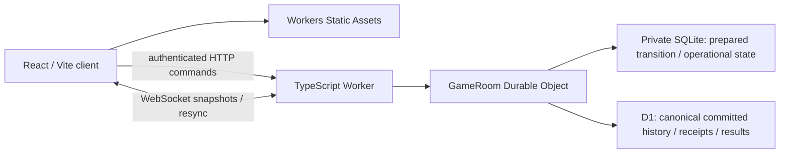

# ADR M3-01: authoritative rooms with canonical D1 commits

Date: 2026-09-06. Decision: retain accepted D09 topology, subject to the explicit
hosted gates below. This ADR defines the architecture contract; the isolated
spike validates its highest-risk local boundaries. It does not implement M3-02
or promise hosted latency, availability, security readiness or production clocks.
[Acceptance plan](m3-01-acceptance.md), [official-source review](m3-01-platform-research.md).

## Topology and ownership



The HTTP Worker routes and applies outer admission checks; the room repeats
authorization and owns every legal transition. One stable namespace/object ID
per game is the only writer. A separate staging namespace must never write the
production game's D1 rows. Engine code stays pure and shared; React, browser
Workers and local saves remain untouched. CPU search remains local M2 behavior.

| Fact | Owner and recovery rule |
| --- | --- |
| Rules state / legality / ordered effects | Existing engine and protocol. The room supplies authorized intentions to replay authoring; it cannot accept client-derived move metadata or scoring. |
| Command order | Room serial queue spanning all external awaits; D1 unique game/command sequence. Command sequence counts accepted actions, distinct from replay sequence, which includes every award and terminal/abort event. |
| Canonical history and result | D1 committed event prefix, receipts and checkpoints. Terminal result is part of the same canonical commit as its cause and all ordered awards. Never update standings from an uncommitted room cache. |
| Pending transition | DO SQLite durable prepared bytes, predecessor hash and receipt. Pending work is a durable promise to reconcile, not yet a client success. D1 cannot independently reconstruct a prepare that never reached it. |
| Hot state / WebSockets | Room memory is disposable. Durable local cache is checked against D1; socket existence proves neither seat ownership nor delivery. |
| Randomness | Server creates initial seed once, stores it with creation, and runs the accepted PRNG only through engine actions. Prepared replay records preserve selection/cursor/candidate hash. No reroll on retry or recovery. |
| Clocks / disconnect banks | Room owns persisted operational timing facts and creates timeout/disconnect actions; canonical actions record their facts. Live scheduling is M3-04, specified below, not implemented in the spike. |
| Producer provenance | Immutable actual build identity in replay-v2. A changed deployment cannot append under an old producer; drain old games or deliberately branch from a verified checkpoint with source replay hash. |

D1 being canonical does **not** make DO storage a write-through cache. It also
holds uncommitted but durable intent and live operational timing. There is no
atomic transaction across these stores. A recovery that loses both the prepare
and its canonical commit cannot recover an unacknowledged action from nothing;
the contract never promises that. An acknowledged command must exist in D1.

## Acknowledgement and recovery state machine

1. Authenticate game/seat, validate exact protocol fields and bounded input.
   Reconcile pending work before exposing state or accepting any new command.
   Look up command ID before stale/terminal checks: same ID and same canonical
   request digest returns its original receipt even after later moves; reuse
   with different content rejects. An unauthorized retry never gets a receipt.
2. Check expected command sequence, current authority and engine legality.
   Generate one entire action plus all effects deterministically. Serialize
   replay/receipt and predecessor snapshot digest. Persist these prepared bytes
   in one local storage write. No success or gameplay broadcast yet.
3. Commit exact prepared data to D1 atomically with unique command ID/sequence.
   On uncertain response, read the primary: identical row is success; absence
   permits inserting that same prepare; different row is a conflict requiring
   quarantine. Verify predecessor digest and complete replay-prefix continuity.
   An SQL constraint failure must not silently become successful no-op work.
4. Atomically replace DO checkpoint/cache and delete pending intent. Keep default
   output gates. Then acknowledge and broadcast the canonical snapshot/receipt.
   No gameplay broadcast is sent while D1 persistence is unresolved. An explicit
   `resyncRequired` control frame carries no state and makes clients reconnect
   immediately, without waiting for the socket close handshake to finish.

| Interruption boundary | Durable facts | Recovery / client meaning |
| --- | --- | --- |
| Before prepare | Old committed prefix only | Retry may create the action; none was accepted or invented. |
| After prepare, before D1 | Exact intended successor is local; D1 old | Room becomes unavailable; finish that intent before other work. Never discard it because a client disconnected. |
| D1 batch fails | Batch leaves old canonical prefix; intent remains | No success. Retry reconciliation; callers retain the same ID. Snapshot/handshake returns unavailable instead of speculative state. |
| D1 commits, response is lost | Both stores may disagree about completion | Primary lookup and exact payload equality prove commit; do not execute the action again. |
| After D1, before local finalize | Canonical successor plus pending intent | Finalize locally from exact canonical data, then resync. |
| After finalize, before response/broadcast | Canonical successor, local successor, no intent | Retry reads original D1 receipt. Send resyncRequired then initiate close on ambiguous runtime error; clients reconnect immediately so observers cannot remain silently stale. |
| Whole process restarts | Local durable stores survive where supported | Recreate room, read primary and intent, reconcile; memory/timers are not authoritative. |
| Local cache disappears | D1 canonical prefix remains | Verify replay-v2 and rebuild cache. Loss of pending intent is a distinct restore incident, not the tested cache-only rebuild. |
| Stores restored to divergent prefixes | Individually valid but incompatible records | Fail closed on predecessor/prefix/hash mismatch. Never select the longest replay or recompute a convenient result. |

The queue deliberately spans D1 awaits; platform storage input gates alone do
not supply this property. See the documented [D1 batch and session semantics](https://developers.cloudflare.com/d1/worker-api/d1-database/)
and [DO storage gates](https://developers.cloudflare.com/durable-objects/api/sqlite-storage-api/),
reviewed 2026-09-06. Single-object authority plus primary reads and unique keys
are assumptions of this algorithm. Out-of-band writers require fencing, not
optimism that identical object names in different namespaces share authority.

Production recovery should use bounded attempts and an explicitly re-armed
alarm for pending intents, with backoff and alerts. Six built-in alarm retries
are insufficient for an extended incident. The spike reconciles on the next
request and has no autonomous alarm; this is an explicit M3-04 gate.
Rejections before prepare are final; 503/timeouts after sending a command are
ambiguous and must be resolved by resync/retry with the same ID. Clients must not
turn a transport error into a new command ID.

## Schema sketches and reconstruction

Actual bounded spike schema is one `commits` table:

```sql
CREATE TABLE commits (
  room TEXT NOT NULL, seq INTEGER NOT NULL,
  command_id TEXT NOT NULL, command_hash TEXT NOT NULL, payload TEXT NOT NULL,
  PRIMARY KEY(room, seq), UNIQUE(room, command_id)
);
```

Each payload contains a complete validated replay-v2 and receipt. Creation is
sequence 0. This makes every restart assertion inspectable, but duplicates
history quadratically and repeatedly validates it. Caps: 64 commands/game,
1,000,000 encoded bytes/snapshot, 4 KiB command body, 16 admitted operations and
8 sockets per room. Oversized bodies are drained while excess bytes are discarded
before returning 413: local stream cancellation itself failed integration. This
bounds retained/accepted bytes, not wire bytes or slow-client duration; external
body deadlines/admission controls remain a production gate. These are probe bounds, not launch capacities. Initialization
DDL is a local convenience; production must use reviewed migrations.

Production normalization proposed for M3-03 (not implemented):

| Table | Keys and data |
| --- | --- |
| `games` | game ID PK; owner namespace generation; protocol/ruleset; creation producer; command head; replay head/hash; initial setup; lifecycle; nullable terminal result/hash |
| `commands` | (game, command ID) unique; (game, command sequence) unique; authenticated seat/session generation; canonical request digest; first/last replay sequence; predecessor/after hashes; stable receipt; authoritative time facts |
| `events` | (game, replay sequence) PK; canonical replay-v2 event JSON; action command sequence; before/after hashes. One row per ordered effect. |
| `checkpoints` | (game, replay sequence) PK; validated state-v2, content hash, producer/source lineage; only complete effect boundaries |
| `seats` / `room_meta` | game/seat/session generation; token digest/expiry; readiness; operational timing/connection metadata, with separate metadata revision |

Insert command, ordered events and optional result/checkpoint and advance the
game head in one D1 batch. Use constraints/fencing that abort the batch on
wrong expected head; checking a zero-row UPDATE after unrelated inserts is too
late. Store each command's expected predecessor and verify the returned head.
Batch size and event pagination need actual engine measurements and D1 parameter
limits; the spike does not validate this future normalized implementation.

Reconstruction starts at a verified full checkpoint, verifies ruleset/setup and
producer lineage, then reads a contiguous canonical event prefix and recomputes
actions/effects with the matching reader. Pending effect queues must finish before
new actions. Complete commits never expose partial awards. Unknown/legacy schemas
reject explicitly. Retain terminal records immutably, including eliminated high
scorers and tied placements. Ratings remain M4; no rating side effects here.

## Authorization and reconnect contract

Production guest identity is a server-issued high-entropy credential, stored as a
digest with expiry/revocation and a session generation. Room invitation is
permission to request a seat, not proof of ownership. Seat assignment and ready
transitions are atomic room operations. Reconnect reauthenticates the same guest
and seat; an arbitrary `actor` field never grants authority. Define concurrent
tabs explicitly (one control generation, others read-only), and revoke old
generations on takeover. These mechanisms are M3-04/M3-05 work.

HTTP commands carry protocol, opaque ID, expected command sequence and a minimal
intention. Only own-seat move/resign/claim is allowed; resignation and Claim Win
retain the engine's legitimate out-of-turn semantics. Automatic walking, timeout
and exhausted-disconnect actions use server authority and stable generated IDs.
Do not accept client clock zeroes, random choices or disconnect-bank assertions.

The local probe uses game/seat-bound HMAC bearer capabilities generated by its
test harness. A random local fixture key grants init/fault/automatic hooks;
neither keys nor tokens are committed. It checks origin and exact versions, binds
only loopback and has no credential issuance, expiry or revocation. These hooks
must not be promoted into production. Config has no real account/database ID or
deployment script. Host checks are additional guardrails, not a production auth
model or proof that a malicious local caller cannot invoke loopback services.

WebSockets deliver full committed snapshots; commands currently use HTTP. The
handshake validates origin, capability and protocol. Browser credentials can use
a short-lived single-use socket ticket or same-origin secured cookie in M3-05;
the probe transports its local capability as a subprotocol and echoes only the
protocol identifier. Never put bearer tokens in URL logs. Reconnect supplies last
command sequence; a future sequence rejects, a stale one receives the latest
snapshot. Client applies monotonic sequence/hash, ignores duplicate snapshots,
and requests full resync on gaps/conflicts. A command receipt can refer to an older
sequence and must not roll the displayed board backwards. No delivery/exactly-once
claim is made about WebSockets themselves. Client state is never authority.

Local testing observed a delivered close frame with the client still CLOSING
beyond five seconds. The control frame above is therefore part of the protocol:
stop using that connection and reconnect immediately on `resyncRequired`, rather
than waiting for a close event. Hosted close-handshake timing remains unproved.

## Clock and disconnect policy for later implementation

No launch time control is selected. A future test fixture may use 60 seconds with
zero increment; this is illustrative only. Store remaining time per seat,
current active seat, server activation timestamp/deadline, last accounted time,
increment policy and operational revision in DO storage. Account elapsed time
from server time, clamp backwards clock movement, and check deadline before every
move as well as on alarm. Alarm arrival time is not the expiration time.

Admission means the serialized authoritative eligibility point after validation,
idempotency and deadline checks. Invalid, unauthorized, stale and duplicate
traffic cannot pause, reset or replenish clocks. For an eligible new command,
record arrival/timing facts, debit the current player up to
admission, and suspend the room while preparing/persisting. The prepared transition
includes resulting balances. Do not start the next player's clock during a D1
wait. After canonical commit, durably activate the next clock in DO storage and
then broadcast that deadline. Persist timing facts in the next canonical action
and checkpoint metadata; clock activation alone does not rewrite replay-v2.
An interruption before activation leaves the room suspended. On restart, enter
explicit recovery suspension and rebase after reconciliation; never charge a
player for unresolved persistence time or infer a timeout from stale client clocks.
Loss/divergence of operational clock storage requires a visible recovery incident,
not an invented elapsed-time calculation from D1's last action timestamp.

Production tests must settle and prove boundaries around debit, durable prepare,
canonical commit and clock activation, including restart before any prepare and
late alarm delivery. Recovery suspension requires a durable incident/resume marker
so repeated restarts cannot repeatedly debit or replenish clocks. This remains an
M3-04 implementation gate; no executable clock reliability is claimed by M3-01.

Track the accepted cumulative 60-second disconnect bank per seat, subtracting only
server-observed disconnected intervals during otherwise running play. Multiple
sockets require a deterministic presence/control policy. Persistence suspension
freezes banks too. On exhaustion generate the existing distinct disconnect fact,
not a fabricated zero main clock. Main-clock expiry and disconnect exhaustion
must have deterministic ordering by earliest server deadline (tie-break documented
before tests); engine opening counts determine abort vs walking forfeit. Never
reinterpret infrastructure interruption as player resignation. Terminal games
stop timing/actions permanently; no repeated terminal or survivor awards.

## Operations, feasibility and alternatives

[Platform review](m3-01-platform-research.md) contains dated official guarantees,
limits, data location, pricing arithmetic, deployment restrictions and source
links. Estimates are hypothetical, not this prototype's measured usage: HTTP
transport scenarios give $5/month for 1,000 games and $426.36 for 100,000 games,
with explicit write/retention assumptions. Keeping objects awake raises the latter
to $713.86. The 40 GB example exceeds a single D1 database and exposes a required
retention/partition decision; it is not evidence that this initial schema scales.
No plan, region, concurrency target or budget ceiling is selected.

Local workflow: Node 24, pnpm 10.33.0, locked Wrangler/workerd, Vite build, local
bindings with a fresh persistent directory. Reuse it only inside restart tests.
CI runs the same local integration without Cloudflare credentials. The existing
Pages deployment stays unchanged. The prototype stages the built React app under
`/li4chess/` for Static Assets routing checks; no site is published.

Later deployment uses Cloudflare GitHub Builds with restricted repository access,
required CI and separate staging resources. DO Workers do not get ordinary preview
URLs, so do not assume automatic PR-state isolation. Pin artifacts, compatibility
date, migration and engine producer. Use additive schema changes and test old
readers before enabling new writers. Rollback changes code, not D1 or DO data;
DO class lifecycle migrations can prevent rollback. Freeze new admission and use
a compatible forward fix when an old build cannot read active games. Coordinated
restore must reconcile D1 receipts, local prepares and clock metadata before play.

Log structured stage/sequence/hash/version/timing/rows/recovery metrics, never
credentials or full personal payloads. Alert on unresolved intent age, canonical
conflicts, rejected replay, storage limits, clock incidents and latency/error
budgets. The probe retains local redacted runtime logs and exact observations;
hosted log retention/sampling/alerts are untested. Canonical history, not logs,
is the audit record. Guest abuse limits, body deadlines, creation/global-rate
limits, privacy/deletion and backup restoration need later implementation.

Retain this architecture while measured canonical acknowledgement latency, costs,
per-game CPU, restore behavior and declared load targets fit. First optimize
indexes, incremental validation, checkpoint cadence and retention. Change the SQL
store only for demonstrated capacity/transaction/placement constraints with a
separate migration ADR. R2 needs measured archive/blob demand; Queues require work
allowed to lag canonical acceptance; Containers need demonstrated heavy compute.
None removes the DO/D1 atomicity boundary. They remain deferred.

## Handoff and remaining gates

| Slice | Concrete next work and required evidence |
| --- | --- |
| M3-02 | Workers foundation: actual React/Vite Static Assets and HTTP package, local Windows workflow, staging/deployment configuration design; preserve Pages until separately authorized transition. Remove all fixture-only hooks from future production entry points. |
| M3-03 | D1 migrations for games, event/receipt/checkpoint storage, retention and canonical results; validate transaction fencing and incremental reconstruction, bounded long-game tests and coordinated restore design. |
| M3-04 | Authoritative GameRoom commands, guest/seat ownership, clocks/alarms, walking scheduling, disconnect banks and recovery suspension/backoff; executable timing-boundary and duplicate-alarm cases. |
| M3-05 | Runtime-validated multiplayer protocol, actual guest credential expiry/revocation, browser reconnect/resync and network interruption UX, four-client consistency, stale/duplicate receipt handling, accessibility retained. |
| M3-06 | Four independent browser Playwright sessions complete games with clocks; refresh, reconnect, disconnect, duplicate/stale/late input, restart and recovery checks run in CI. Add separately authorized isolated hosted staging, GitHub build/rollback, backup, hibernation, regional latency/load/cost and observability tests. |

Local tests cannot establish geographically distributed consistency/latency,
regional failover, hosted hibernation billing, PITR, deploy disconnect behavior or
alarm timing. Those are precise hosted gates, not reasons to claim M3 complete.
Stop this task after M3-01 evidence, review, commits and draft PR.
